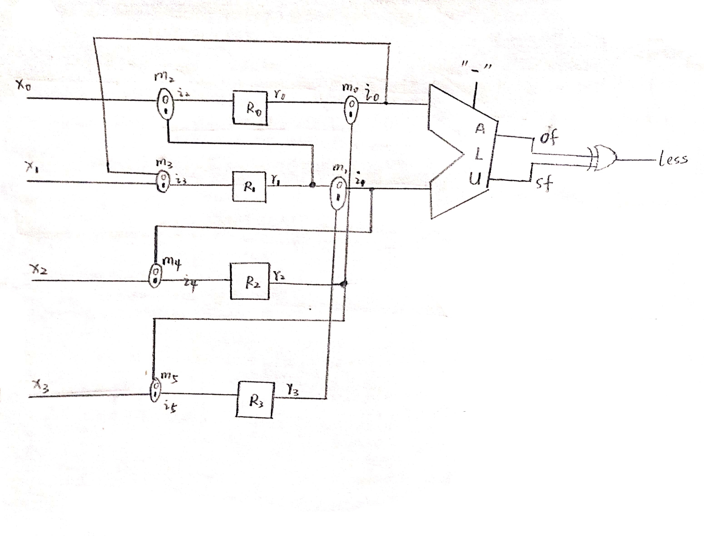
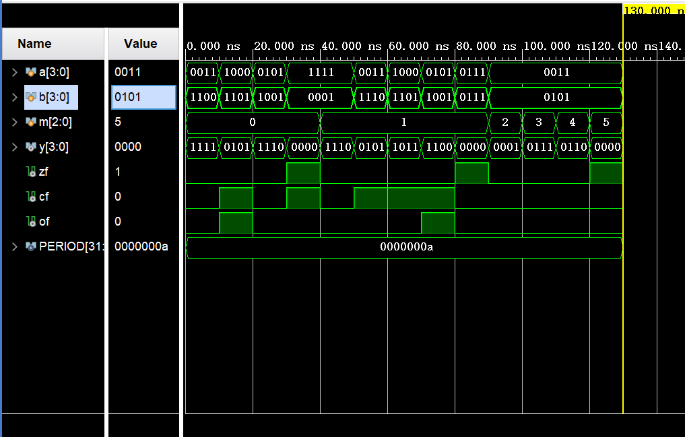
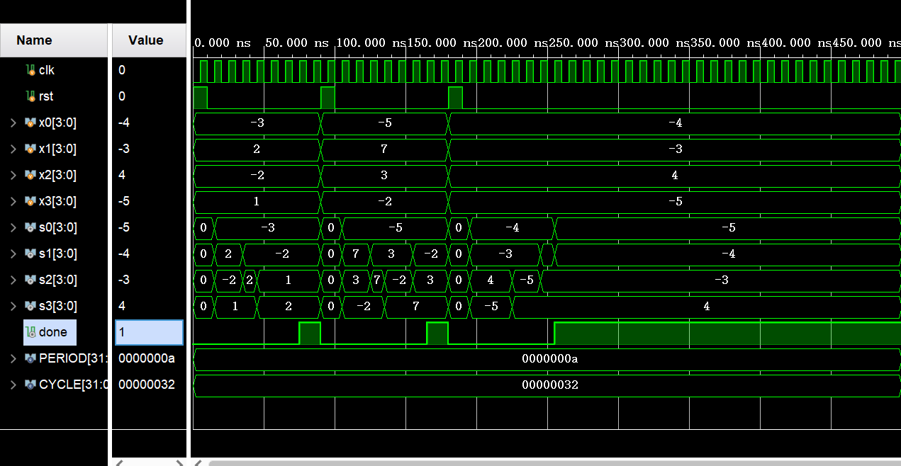
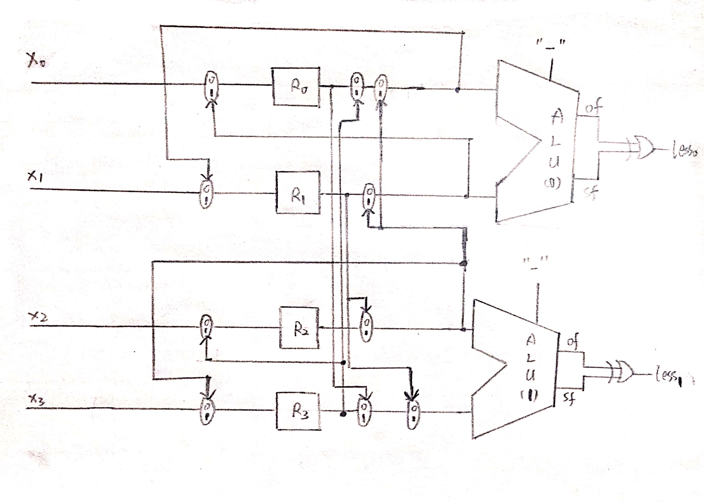

# Lab1 Report

## PB18111684 吴钰同

[toc]

### 实验要求

1.采用行为方式描述参数化的ALU模块，并进行功能仿真；

2.设计排序电路的数据通路和控制器，采用结构化方式描述数据通路，两段式FSM描述控制器，并进行功能仿真。

### 逻辑设计

#### 数据通路



#### 状态图

| 序号 | 状态名 | $m_0 \sim m_5$ | $EN_0 \sim EN_3$  | $done$ |
| :--: | :----: | :------------: | :---------------: | :----: |
|  0   |  LOAD  |     xx0111     |       1111        |   0    |
|  1   | CX01_1 |     0010xx     | \~less,~less,0,0  |   0    |
|  2   | CX12_1 |     10x00x     |   0,less,less,0   |   0    |
|  3   | CX23_1 |     11xx00     | 0,0,\~less,\~less |   0    |
|  4   | CX01_2 |     0010xx     | \~less,~less,0,0  |   0    |
|  5   | CX12_2 |     10x00x     |   0,less,less,0   |   0    |
|  6   | CX01_3 |     0010xx     | \~less,~less,0,0  |   0    |
|  7   |  HLT   |     xxxxxx     |       0000        |   1    |

### 核心代码

#### ALU

```verilog
//ALU.v
`timescale 1ns / 1ps

module ALU  
    #(parameter WIDTH = 32, //数据宽度
    ADD=3'b000,
    SUB=3'b001,
    AND=3'b010,
    OR=3'b011,
    XOR=3'b100
    ) 	
    (output reg [WIDTH-1:0] y, 		//运算结果
    output reg zf, 					//零标志
    output reg cf, 					//进位/借位标志
    output reg of, 					//溢出标志
    output reg sf,                 //结果的最高位
    input [WIDTH-1:0] a, b,		//两操作数
    input [2:0] m						//操作类型
    );

always@(*) begin
    y=32'h0;
    {zf,cf,of}=3'h0;
    case(m)
        ADD: begin 
            {cf,y}=a+b;
            of = (~a[WIDTH-1] & ~b[WIDTH-1] & y[WIDTH-1]) | (a[WIDTH-1] & b[WIDTH-1] & ~y[WIDTH-1]);
            end
        SUB: begin
            {cf,y}=a-b;
            of = (~a[WIDTH-1] & b[WIDTH-1] & y[WIDTH-1]) | (a[WIDTH-1] & ~b[WIDTH-1] & ~y[WIDTH-1]);            
            end
        AND: begin
            y=a&b;
            end
        OR: begin
            y=a|b;
            end
        XOR: begin
            y=a^b;
            end
    endcase
    zf=~|y;
    sf=y[WIDTH-1];
end

endmodule
```

#### 排序电路

```verilog
//sort.v
`timescale 1ns / 1ps

module sort
    #(parameter WIDTH = 4, //数据宽度
      LOAD=3'b000,
      CX01_1=3'b001,
      CX12_1=3'b010,
      CX23_1=3'b011,
      CX01_2=3'b100,
      CX12_2=3'b101,
      CX01_3=3'b110,
      HLT=3'b111
    )
    (output [WIDTH-1:0] s0, s1, s2, s3, 	//排序后的四个数据（递增）
    output reg done, 				//排序结束标志
    input [WIDTH-1:0] x0, x1, x2, x3,	//原始输入数据
    input CLK, RST				//时钟（上升沿有效）、复位（高电平有效）
    );
    wire [3:0]  i0,i1,i2,i3,i4,i5,r0,r1,r2,r3;
    wire of,sf,less;    
    reg m0,m1,m2,m3,m4,m5,en0,en1,en2,en3;
    reg [2:0] SUB=3'b001;
    reg [2:0] current_state,next_state;
    //Data Path
    Register R0(i2,CLK,en0,RST,r0);
    Register R1(i3,CLK,en1,RST,r1);
    Register R2(i4,CLK,en2,RST,r2);
    Register R3(i5,CLK,en3,RST,r3);
    ALU #(.WIDTH(WIDTH)) ALU(.a(i0),.b(i1),.of(of),.sf(sf),.m(SUB));
    MUX M0(m0,r0,r2,i0);
    MUX M1(m1,r1,r3,i1);
    MUX M2(m2,x0,r1,i2);
    MUX M3(m3,i0,x1,i3);
    MUX M4(m4,i1,x2,i4);
    MUX M5(m5,r2,x3,i5);
    // Control Unit
    assign s0=r0;
    assign s1=r1;
    assign s2=r2;
    assign s3=r3;
    assign less=of^sf;
    always@(posedge CLK or posedge RST) begin
        if(RST) current_state<=LOAD; 
        else current_state<=next_state;
    end
    always@(*) begin
        if(current_state!=HLT) next_state=current_state+1;
    end
    always@(*) begin
        {m0,m1,m2,m3,m4,m5,en0,en1,en2,en3,done}=11'h0;
        case(current_state)
            LOAD:{m3,m4,m5,en0,en1,en2,en3}=7'b111_1111;
            CX01_1,CX01_2,CX01_3:begin m2=1;en0=~less;en1=~less; end
            CX12_1,CX12_2:begin m0=1;en1=less;en2=less; end
            CX23_1:begin m0=1;m1=1;en2=~less;en3=~less; end
            HLT: done=1;
        endcase
    end
endmodule
```

### 仿真结果及分析

#### ALU



对于第2组数据，若均为无符号数，则最高位产生进位，cf置1；若均为有符号数，则两个正数相加得负数，说明溢出，of置1。

对于第4组数据，若均为无符号数，则最高位产生进位，cf置1；若均为有符号数，则为-1+1=0，没有溢出，of置0。无论哪种情况结果都为0，所以zf置1。以上两组数据证明加法器工作正常。

对于第6组数据，若均为无符号数，则最高位产生借位，cf置1；若均为有符号数，则为3-(-2)=5，没有溢出，of置0，该组数据证明减法器工作正常。

对于最后4组数据，有：

0011&0101=0001，0011|0101=0111，0011^0101=0110，最后一组输入无效。

所以其他功能工作正常。

#### 排序电路



对于第一组数据x0\~x3=-3,2,-2,1，经过8个周期后done被置1，s0\~s3=-3,-2,1,2，说明实现了对4个有符号数的升序排序，其余两组数据类似。

### 思考题

**1.如果要求排序后的数据是递减顺序，电路如何调整？**

只需把最后生成less信号用的异或门改成同或门即可。

**2.如果为了提高性能，使用两个ALU，电路如何调整？**

如下图调整：



排序时，第一个时钟周期并行地比较并交换R0,R1和R2,R3，第二个时钟周期并行地比较并交换R0,R2和R1,R3，第三个时钟周期用下面的ALU比较并交换R1,R2，即可完成排序。只需3个时钟周期，而优化前需要8个时钟周期。

### 实验总结

本次实验我完成了以下任务：

- 复习Verilog语言和Vivado软件的使用。
- 复习两段式有限状态机的编写。
- 根据课件和视频画出数据通路和状态机。
- 编写ALU和排序电路并进行仿真。

### 建议

建议修改实验课件中的一些小错误。