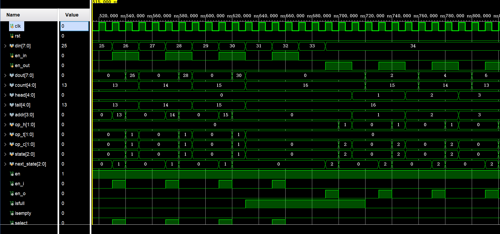

# Lab2 Report

## PB18111684 吴钰同

[toc]

### 实验要求

1. 采用行为方式描述参数化的寄存器堆，并进行功能仿真；

2. 采用IP例化方式分别实现分布式和块式的16 x 8位单端口RAM，并进行功能仿真和对比；

3. 设计FIFO队列电路的数据通路和控制器，采用结构化方式描述数据通路，两段式FSM描述控制器，并进行功能仿真；

### 逻辑设计

#### 数据通路


#### 状态图


### 核心代码

#### 寄存器堆

```verilog
`timescale 1ns / 1ps

module register_file				
#(parameter WIDTH = 32) 	
(   input clk,						
    input [4:0] ra0,				
    output [WIDTH-1:0] rd0, 	
    input [4:0] ra1, 				
    output [WIDTH-1:0] rd1, 	
    input [4:0] wa, 				
    input we,				
    input [WIDTH-1:0] wd
);
    reg [WIDTH-1:0] regs [31:0]; //32 32-bit binary codes
    initial $readmemh("C:\\Users\\lenovo\\Desktop\\git\\COD-2020-Labs\\Lab2\\Lab2.srcs\\sources_1\\new\\init.txt",regs);
    assign rd0 = regs[ra0];
    assign rd1 = regs[ra1];
    always@(posedge clk) begin
        if(we) regs[wa]<=wd;
    end
endmodule
```

#### FIFO 电路

```verilog
`timescale 1ns / 1ps

module fifo #(parameter WIDTH = 4,
      DONOTHING=3'b000,
      QIN=3'b001,
      QOUT=3'b010
    )
    (
    input clk, rst,	
    input [7:0] din,		
    input en_in, 		
    input en_out,		
    output [7:0] dout, 	
    output [4:0] count 
);
    wire en,en_i,en_o;
    wire [4:0] head,tail;
    wire isfull,isempty;
    wire select;
    wire we;
    wire [3:0] addr;
    reg [1:0] op_h,op_t,op_c;
    reg [2:0] state,next_state;
    
    //Data Path
    assign en=1;
    assign isfull=count[4];
    assign isempty=~|count;
    assign select=(en_i&~en_o);
    assign we=en_i&~isfull;
    
    EDG EDG_i(clk,rst,en_in,en_i);
    EDG EDG_o(clk,rst,en_out,en_o);
    counter counter_h(clk,rst,op_h,head);
    counter counter_t(clk,rst,op_t,tail);
    counter counter_count(clk,rst,op_c,count);  
    Block_RAM_wf Block_RAM_wf(.addra(addr),.clka(clk),.dina(din),.douta(dout),.ena(en),.wea(we));
    MUX MUX(select,head,tail,addr);
    
    //Control Unit
    //state logic
    always@(posedge clk or posedge rst) begin
        if(rst) state<=DONOTHING; 
        else state<=next_state;
    end
    //next state logic
    always@(*) begin
        next_state=DONOTHING;
        case({en_i,en_o})
            2'b10: if(~isfull) begin next_state=QIN; end
            2'b01: if(~isempty) begin next_state=QOUT; end
        endcase
    end
    //output logic
    always@(*) begin
        {op_t,op_h,op_c}=6'h0;
        case(state)
            QIN: begin op_t=2'b01;op_c=2'b01;end
            QOUT: begin op_h=2'b01;op_c=2'b10;end
        endcase
    end
endmodule
```

这里严格意义上 assign 不属于结构化描述，应该改成实例化的逻辑门，但是我觉得那样不太直观，而且和 assign 实质上等价，所以就没改。

### 仿真结果及分析

#### 寄存器堆


我提前把所有寄存器都初始化了-1。第一个时钟周期写使能为0，两个端口读的结果都是-1；第二个时钟周期写使能为1，在上升沿的时候把0号寄存器赋值了12；第三个时钟周期写使能为1，在上升沿的时候把1号寄存器赋值了12；第四个时钟周期写使能为0，寄存器值不变，故两个读端口的数据不变。

#### RAM


首先我们注意到，分布式的 RAM 的读端口是异步的，而块式的 RAM 的读端口是与时钟周期同步的，即仅当时钟上升沿时读端口的数据才会改变，所以一开始块状 RAM 的读端口输出0（从第五个时钟周期也可以看出）。对于写端口，两种 RAM 都是异步的（从第二个时钟周期可以看出）。然后我们注意到，块状 RAM 的读写模式有三种：写优先，读优先和不改变。

对于写优先的块状 RAM ，如果一个时钟周期内既有读又有写操作，会读出写之后的结果，如第二个时钟周期的时钟上升沿，在向2号内存写入4的同时从读端口读出了4。而读优先的 RAM 则在直到下一个时钟上升沿之前都保持写操作之前对应内存区域的值，如同样的位置读优先的 RAM 一直读出-1。最后，不改变的 RAM 当遇到并发的读写操作时始终保持读端口不变，这里一直保持-1直到写使能关闭。

#### FIFO 电路

 

根据 MUX 的选择，addr 仅在进队使能有效的时候被设置为 tail 指针对应的地址，否则为 head 指针对应的地址，所以除了进队的时候 dout 显示队尾（进来的）值，其他情况都显示队首的值。又由上面提到的块状 RAM 的异步读写（这里是写优先模式），dout 的改变会延后一个周期，所以 dout 是很长一段队首元素（0），再接着一小段队尾元素。



当 count=16 时，即使进队使能有效也不会打开写使能，所以此时不会再有数据进队，dout 一直显示队首元素。


当出队使能有效时，由于状态机的设计，头指针在下一个时钟周期的上升沿递增，由于 dout 的改变比头指针的改变滞后一个时钟周期，所以我这里为了好看，让 counter 模块在做减法的时候推迟了一个时钟周期，从而 count 的变化与 dout 的变化对齐。它们都比实际的出队使能信号滞后两个时钟周期。


最后，当队列为空时，即使出队使能信号有效也不会出队，此时由于 head 指针溢出，addr 为队列中编号为0的位置。

### 思考题

**如何利用寄存器堆和适当电路设计实现可变个数的数据排序电路？**

冒泡排序，从头到尾不断读出相邻的数据，比较并借助另一个寄存器交换即可实现。

### 实验总结

本次实验我完成了以下任务：

- 复习 ip 核的使用。
- 查找资料，了解两种 RAM 的区别。
- 根据课件和视频画出数据通路和状态机。
- 编写寄存器堆和 FIFO 电路并进行仿真。

### 参考资料

https://zhuanlan.zhihu.com/p/51600261


