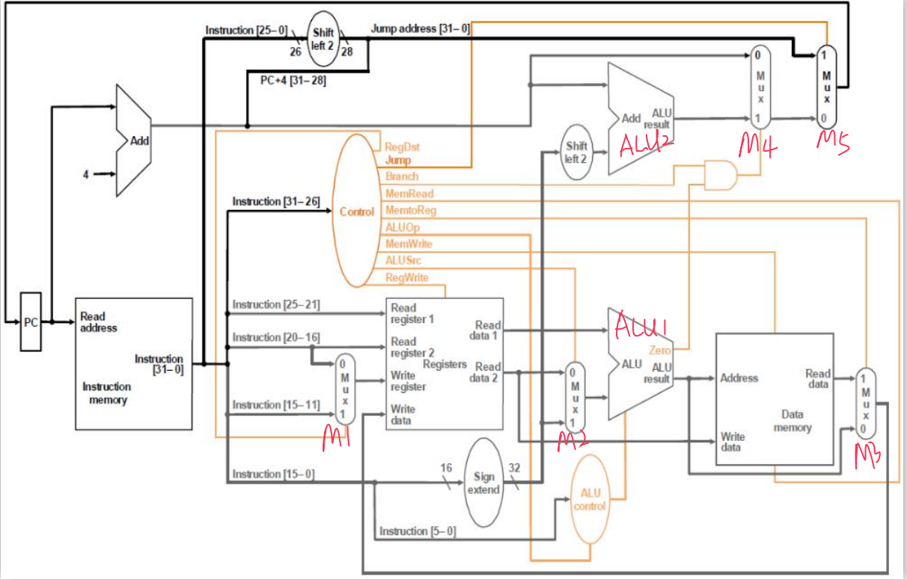
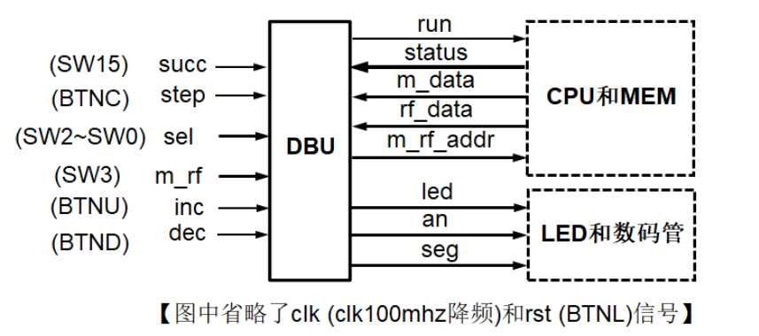
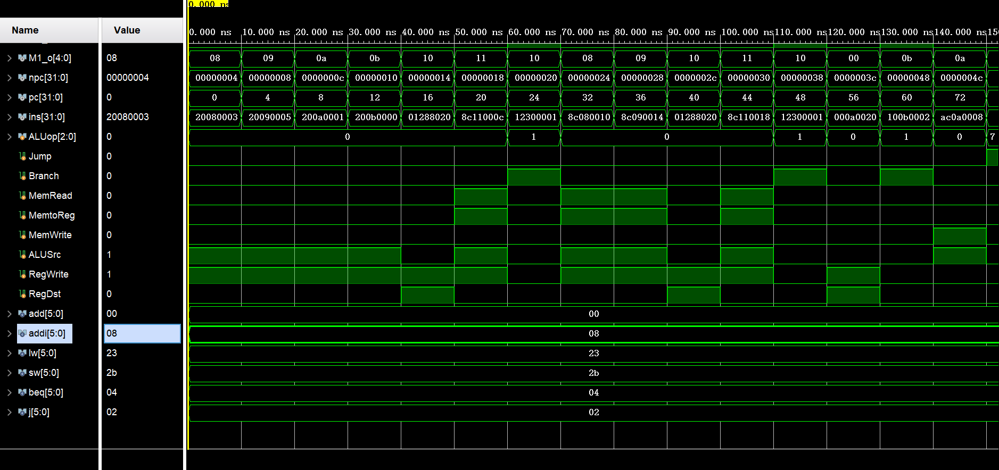
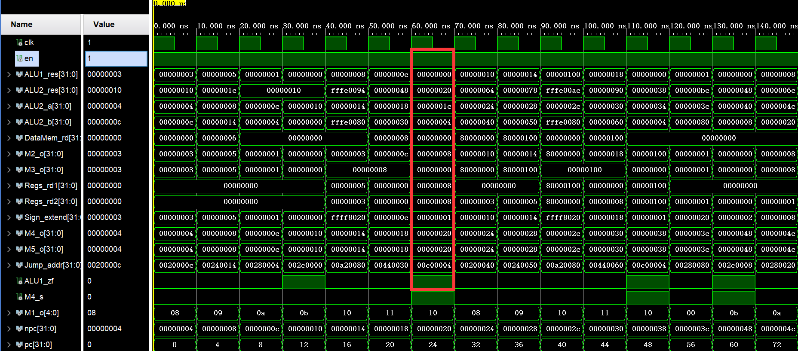
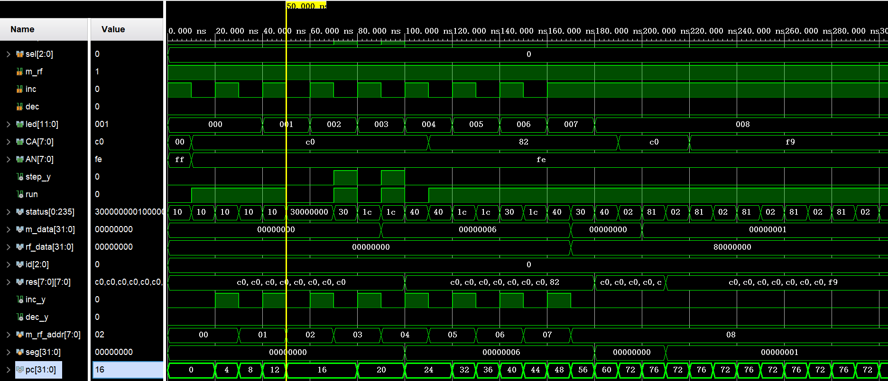
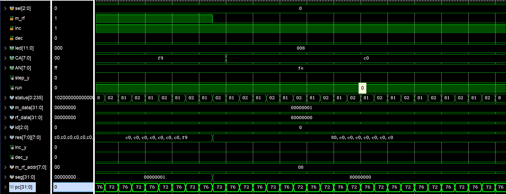
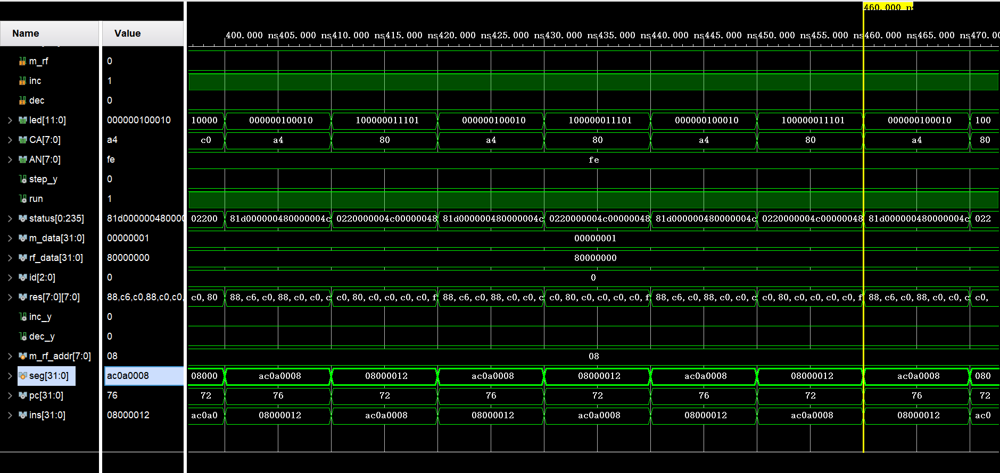

# Lab3 Report

## PB18111684 吴钰同

[toc]

### 实验要求

1. 结构化描述单周期 CPU 的数据通路和控制器，并进行功能仿真；

2. 设计实现调试单元（DBU），并进行功能仿真；

### 逻辑设计

#### CPU



#### DBU



### 核心代码

#### CPU

```verilog
`timescale 1ns / 1ps

module CPU( //单周期 CPU
    input clk, //上升沿有效
    input rst, //异步复位，高电平有效
    input run, //是否继续运行
    input [7:0] m_rf_addr, // MEM/RF 的调试读口地址，复位时为零
    output [0:235] status,  //用一个大数组来装12个控制信号和7*32位供sel选择的数据
    output [31:0] m_data,  // MEM 的数据
    output [31:0] rf_data  // RF 的数据
    );
    parameter add=6'b000000;
    parameter addi=6'b001000;
    parameter lw=6'b100011;
    parameter sw=6'b101011;
    parameter beq=6'b000100;
    parameter j=6'b000010;

    wire clk;
    wire en=1;
    wire [31:0] ALU1_res,ALU2_res,ALU2_a,ALU2_b,DataMem_rd,
    M2_o,M3_o,Regs_rd1,Regs_rd2,Sign_extend,M4_o,M5_o,Jump_addr;
    wire ALU1_zf,M4_s;
    wire [4:0] M1_o;
    wire [31:0] npc,pc,ins;
    reg [2:0] ALUop;
    reg Jump,Branch,MemRead,MemtoReg,MemWrite,ALUSrc,RegWrite,RegDst; //control signals
    
    //Data Path
    assign ALU2_a=pc+4;
    assign Sign_extend={ { 16{ins[15]} } , ins[15:0]};
    assign ALU2_b=Sign_extend<<2;
    assign M4_s=Branch&ALU1_zf;
    assign Jump_addr={ALU2_a[31:28],ins[25:0]<<2};
    assign npc=run?M5_o:pc;
    assign status={Jump, Branch, RegDst,RegWrite, MemRead, MemtoReg,MemWrite,ALUop,
    ALUSrc, ALU1_zf, npc, pc, ins, Regs_rd1, Regs_rd2, ALU1_res, DataMem_rd};
    
    PC_Register PC_Register(npc,clk,en,rst,pc);
    Instruction_Memory Instruction_Memory(.a(pc[31:2]),.spo(ins));
    Data_Memory Data_Memory(.a(ALU1_res[31:2]),
                            .d(Regs_rd2),
                            .clk(clk),
                            .we(MemWrite),
                            .spo(DataMem_rd),
                            .dpra({10'h0,m_rf_addr[7:2]}),
                            .dpo(m_data));
    Registers Registers(.clk(clk), 
                        .ra1(ins[25:21]),
                        .ra2(ins[20:16]),
                        .ra3(m_rf_addr[4:0]),
                        .wa(M1_o),
                        .wd(M3_o),
                        .we(RegWrite),
                        .rd1(Regs_rd1),
                        .rd2(Regs_rd2),
                        .rd3(rf_data));
    
    ALU ALU1(.y(ALU1_res),.m(ALUop),.a(Regs_rd1),.b(M2_o),.zf(ALU1_zf));
    ALU ALU2(.y(ALU2_res),.m(3'b000),.a(ALU2_a),.b(ALU2_b));
    
    MUX  #(.WIDTH(5)) M1(.s(RegDst), .w0(ins[20:16]), .w1(ins[15:11]), .o(M1_o));
    MUX  #(.WIDTH(32)) M2(.s(ALUSrc), .w0(Regs_rd2), .w1(Sign_extend), .o(M2_o));
    MUX  #(.WIDTH(32)) M3(.s(MemtoReg), .w0(ALU1_res), .w1(DataMem_rd), .o(M3_o)); 
    MUX  #(.WIDTH(32)) M4(.s(M4_s), .w0(pc+4), .w1(ALU2_res),.o(M4_o));
    MUX  #(.WIDTH(32)) M5(.s(Jump), .w0(M4_o), .w1(Jump_addr),.o(M5_o));
    
    //Control Unit
    always@(*) begin
            {Jump,Branch,MemRead,MemtoReg,MemWrite,ALUSrc,RegWrite,RegDst}=9'b0;
            ALUop<=3'b111;
            case(ins[31:26])
                add: begin
                    ALUop<=3'b000;
                    RegWrite<=1;
                    RegDst<=1;
                end
                addi:begin
                    ALUop<=3'b000;
                    RegWrite<=1;
                    ALUSrc<=1;
                end
                lw: begin
                    ALUop<=3'b000;
                    MemRead<=1;
                    MemtoReg<=1;
                    ALUSrc<=1;
                    RegWrite<=1;
                end
                sw: begin
                    ALUop<=3'b000;
                    MemWrite<=1;
                    ALUSrc<=1;
                end
                beq: begin
                    Branch<=1;
                    ALUop<=3'b001;
                end
                j: Jump<=1;
            endcase
        end
endmodule
```

#### DBU

```verilog
module DBU(
    input clk,
    input rst,
    input succ,
    input step,
    input [2:0] sel,
    input m_rf,
    input inc,
    input dec,
    output reg [11:0] led, //用后8个 LED 灯显示地址  
    output reg [7:0] CA,
    output reg [7:0] AN
    );
    wire step_y,run;
    wire [0:235] status;
    wire [31:0] m_data,rf_data;
    wire [2:0] id;
    wire [7:0] res [7:0];
    reg [7:0] m_rf_addr;
    reg [31:0] seg;
    
    EDG EDG(clk,rst,step,step_y);
    CPU CPU(clk,rst,run,m_rf_addr,status,m_data,rf_data);
    
    counter counter(clk,rst,id);
    hex_segment_display S0(.a(seg[3:0]), .spo(res[0]));
    hex_segment_display S1(.a(seg[7:4]), .spo(res[1]));
    hex_segment_display S2(.a(seg[11:8]), .spo(res[2]));
    hex_segment_display S3(.a(seg[15:12]), .spo(res[3]));
    hex_segment_display S4(.a(seg[19:16]), .spo(res[4]));
    hex_segment_display S5(.a(seg[23:20]), .spo(res[5]));
    hex_segment_display S6(.a(seg[27:24]), .spo(res[6]));
    hex_segment_display S7(.a(seg[31:28]), .spo(res[7]));

     always @ (posedge clk, posedge rst) begin
        if(rst) AN<=8'b1111_1111;
        case(id)
            3'b000: begin AN<=8'b1111_1110;CA<=res[0]; end
            3'b001: begin AN<=8'b1111_1101;CA<=res[1]; end
            3'b010: begin AN<=8'b1111_1011;CA<=res[2]; end
            3'b011: begin AN<=8'b1111_0111;CA<=res[3]; end
            3'b100: begin AN<=8'b1110_1111;CA<=res[4]; end
            3'b101: begin AN<=8'b1101_1111;CA<=res[5]; end
            3'b110: begin AN<=8'b1011_1111;CA<=res[6]; end
            3'b111: begin AN<=8'b0111_1111;CA<=res[7]; end
        endcase
    end
    
    assign run=succ|step_y;
    always@(posedge clk,negedge rst) begin
        if(rst) begin 
            m_rf_addr<=0;
            led<=0;
            CA<=0;
            m_rf_addr<=0;
            seg<=0;
        end
        else begin
            led=status[0:11];
            case(sel)
                3'b000: begin
                    if(inc) m_rf_addr<=m_rf_addr+1;
                    if(dec) m_rf_addr<=m_rf_addr-1;
                    led[11:8]<=4'b0000;
                    led[7:0]<=m_rf_addr;
                    if(m_rf) seg<=m_data;
                    else seg<=rf_data;
                end
                3'b001: seg<=status[12:43];
                3'b010: seg<=status[44:75];
                3'b011: seg<=status[76:107];
                3'b100: seg<=status[108:139];
                3'b101: seg<=status[140:171];
                3'b110: seg<=status[172:203];
                3'b111: seg<=status[204:235];
            endcase
         end
    end
endmodule
```

### 仿真结果及分析

先贴一下助教给的测试代码：

```mipsasm
# MIPS程序按字节编址（每个地址对应8个二进制数），指令和数据存储器按字编址（每个地址对应32个二进制数）
# 初始PC = 0x00000000

.data
    .word 0,6,0,8,0x80000000,0x80000100,0x100,5,0   #编译成机器码时，编译器会在前面多加个0，所以后面lw指令地址会多加4

_start:    
		addi $t0,$0,3       	#t0=3   0  
        addi $t1,$0,5   		#t1=5	4  
		addi $t2,$0,1       	#t2=1	8
		addi $t3,$0,0			#t3=0	12

        add  $s0,$t1,$t0  		#s0=t1+t0=8  测试add指令	16
        lw   $s1,12($0)  		#							20
        beq  $s1,$s0,_next1		#正确跳到_next1 				24
		
		j _fail					

_next1:	
		lw $t0, 16($0)			#t0 = 0x80000000	32
		lw $t1, 20($0)			#t1 = 0x80000100	36
		
		add  $s0,$t1,$t0		#s0 = 0x00000100 = 256	40
		lw $s1, 24($0)			#						44
        beq  $s1,$s0,_next2		#正确跳到_next2		48
		
		j _fail				    #						52

_next2:
		add $0, $0, $t2			#$0应该一直为0			56
		beq $0,$t3,_success		#						60
		
		
_fail:  
		sw   $t3,8($0) #失败通过看存储器地址0x08里值，若为0则测试不通过，最初地址0x08里值为0      64
        j    _fail  #68

_success: 
		sw   $t2,8($0)    #全部测试通过，存储器地址0x08里值为1  72
		j   _success      #76

					  #判断测试通过的条件是最后存储器地址0x08里值为1，说明全部通过测试
```

将上述代码编译，得到如下十六进制形式的 MIPS 指令。

```assembly
#ins.coe
memory_initialization_radix  = 16;
memory_initialization_vector =
20080003
20090005
200a0001
200b0000
01288020
8c11000c
12300001
08000010
8c080010
8c090014
01288020
8c110018
12300001
08000010
000a0020
100b0002
ac0b0008
08000010
ac0a0008
08000012
```

以下为数据：

```assembly
#data.coe
memory_initialization_radix  = 16;
memory_initialization_vector =
00000000
00000006
00000000
00000008
80000000
80000100
00000100
00000005
00000000
```

#### CPU



首先让 CPU 连续运行：注意到三处 Beq 指令分别从 PC=24 跳到 PC=32 ，从 PC=48 跳到 PC=56，从 PC=60 跳到 PC=72。由于它们都成功跳转了，说明 add 指令和 lw 指令成功执行。又前4条指令都是 addi 指令，故 ALUSrc=1 选择立即数端；由于要写寄存器， RegWrite=1。第5条指令是 add 指令，故 ALUSrc=0 选择寄存器端，RegDst=1 选择 ins[15:11] 对应的寄存器。



再以 PC=24 的 beq 指令为例：首先将 ins[25:21] 和 ins [20:16] 对应的寄存器值读出，此处为 Regs_rd1 和 Regs_rd2 ，都为8。然后经 ALU 作减法运算（注意到，上图的 ALUop 变成了1）得到0，故 ALU1_zf 置1。由数据通路我们知道，当 Branch 和 ALU1_zf 信号均为1时，M4_s=1 ，此时选择 ALU2_res 作为 npc ，此处为 0x20=32，所以下一个时钟周期跳转到 PC=32 的指令。其他指令与上述分析类似，不再赘述。

#### DBU

先贴一下仿真程序：

```verilog
`timescale 1ns / 1ps

module lab3_dbu_tb();
    reg clk,rst,succ,step,m_rf,inc,dec;
    reg [2:0] sel;
    wire [11:0] led; 
    wire [7:0] CA,AN;
    DBU DBU(clk,rst,succ,step,sel,m_rf,inc,dec,led,CA,AN);
    initial begin
        clk=1;
        repeat (500)
            #(5) clk=~clk;
    end
    initial begin
        inc=1;
        repeat (16)
            #(10) inc=~inc;
    end
    initial begin
        rst=1;
        succ=0;
        step=0;
        sel=0;
        m_rf=1;
        dec=0;
        #10
        rst=0;
        succ=1;
        #40
        succ=0;
        #20
        step=1;
        #10
        step=0;
        #10
        step=1;
        #10
        step=0;
        #10
        succ=1;
        #80
        #100
        m_rf=0;
        #100
        sel=3;
        #100;
    end
endmodule
```

由于没有板子，七段数码管显示数据不知道对错。事实上，我直接使用了上学期数字电路实验的代码。

信号和各个模块的具体数据在上文中已经分析过了，对于 DBU ，只需把它们都塞到一个 status 数组中，然后按指定的位进行读取即可，这里也不再进行仿真分析。



首先，我在 PC=16 处关掉 succ，此时处于单步调试模式；然后我取了 step 的上升沿，每按一下 step 就产生一个时钟周期的脉冲 step_y ，此时 run=1，所以 PC=16,20,24 运行的时间更长（实际上，是把当前的 PC 赋值给了 NPC ），说明单步调试模式是正确的。

同时，注意到我的 inc_y 是不断有脉冲的，说明 addr 是不断增加的。直到 addr=8 时停止增加。此时，我们可以看到 seg 的值为1，由于 m_rf=1 ，说明此时看的是存储器的值。即存储器中的 0x08 地址为1，说明上述程序运行结果是正确的。



若干个时钟周期后，我又把 m_rf 设成了0，此时 seg 的值为8号寄存器（$t0）的值，由以上程序容易知道，该值恰为 0x80000000 。综上所述，查看 CPU 运行结果的 DBU 是正确的。



最后我让 sel=3 ，此时 seg 应该输出指令 ins 的内容，但由于时钟的问题，DBU 比 CPU 滞后一个周期，故 seg 显示的是前一个周期的指令，如 0x08000012 对应的是 j 指令，它对应的 LED 显示信号，只有 Jump，ALUop 和ALUzero 为1，其他均为0。所以查看 CPU 运行过程的 DBU 是正确的。

### 思考题

1. 修改数据通路和控制器，增加支持如下指令：

```assembly
accm: rd <- M(rs) + rt; 	op = 000000, funct = 101000
```

首先需要增加 ALU control 来区分 accm 和 add，然后在 Data Memory 后面加一条线以及多路选择器，使得内存数据能够作为 ALU 的运算数；同时引一条从寄存器的读口到 Data Memory 的 addr 口的线，使得寄存器输出可以直接作为内存的取数地址。最后，修改控制单元使得读 M[rs] 先进行，再用 ALU 做加法，把结果再存回寄存器。 

### 实验总结

本次实验我完成了以下任务：

- 根据课件和视频编写 CPU 。
- 根据课件和视频设计并编写 DBU。
- 根据助教给的测试代码进行仿真测试。
- 复习七段数码管显示的相关知识。
