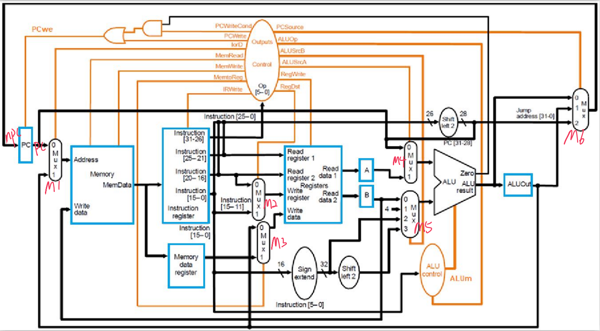
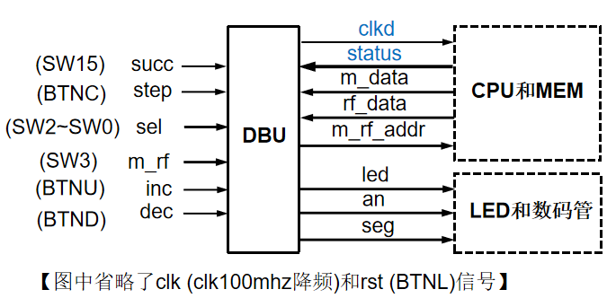
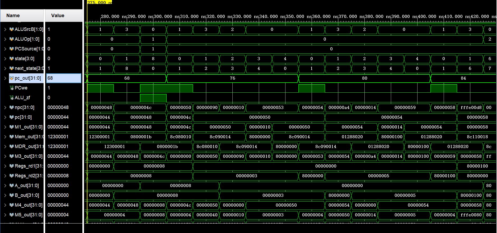
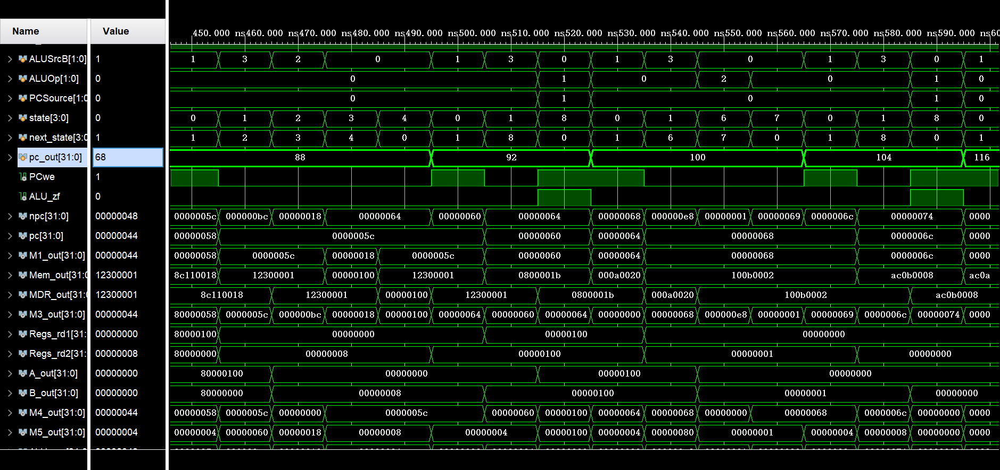
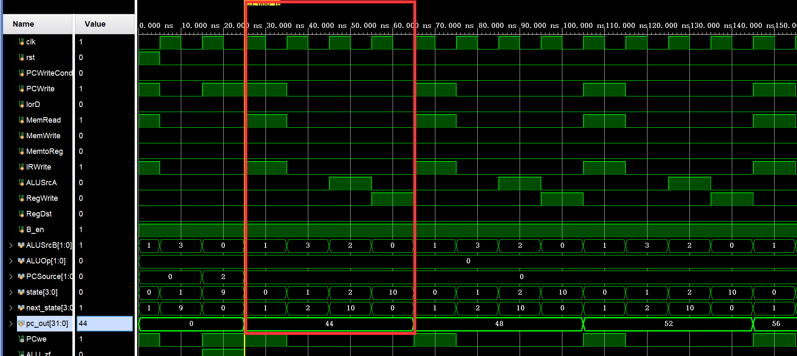
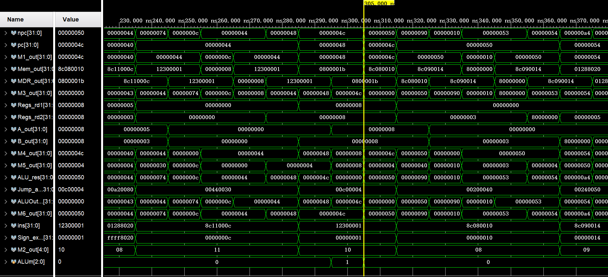
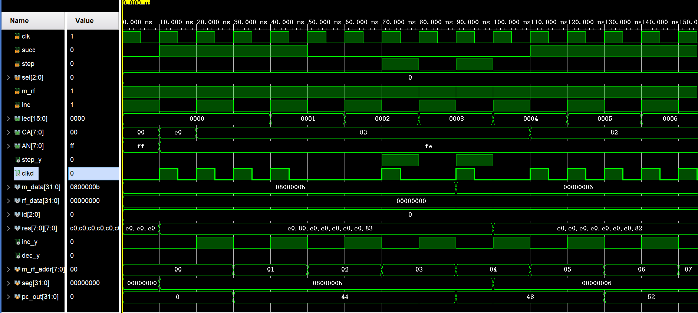
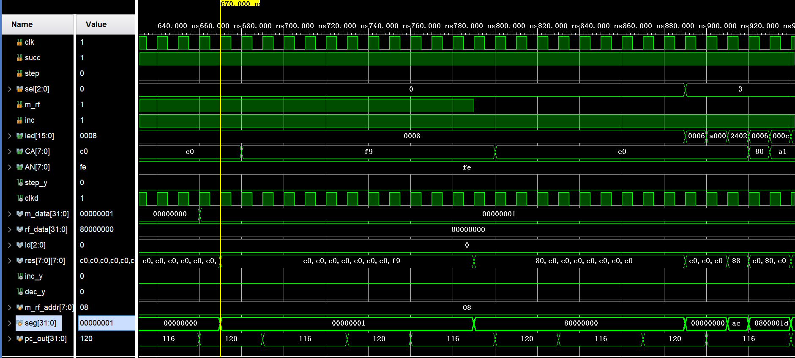
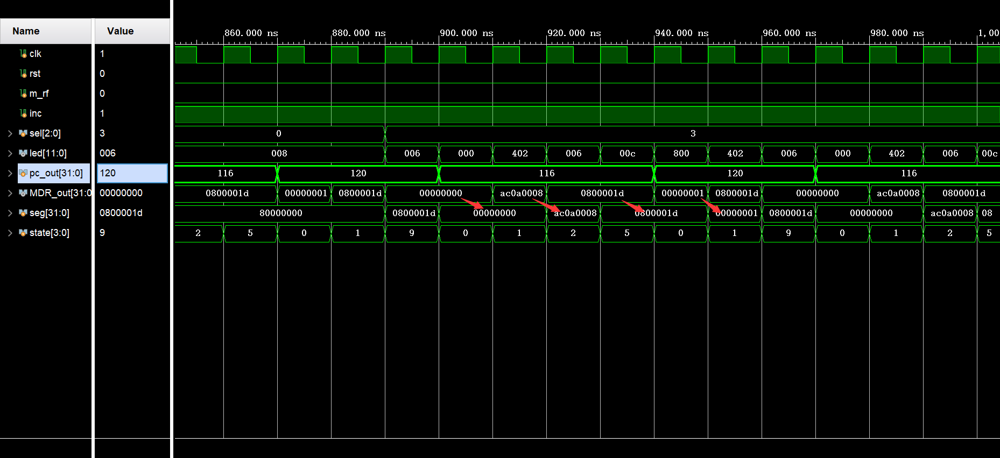

# Lab4 Report

## PB18111684 吴钰同

[toc]

### 实验要求

结构化描述多周期CPU的数据通路和控制器，并进行功能仿真。

### 逻辑设计

#### CPU

##### 数据通路



##### 状态机


#### DBU



### 核心代码

#### CPU

```verilog
module CPU( //多周期 CPU
    input clk, //上升沿有效
    input rst, //异步复位，高电平有效
    input [7:0] m_rf_addr, // MEM/RF 的调试读口地址，复位时为零
    output [0:207] status,  //用一个大数组来装12个控制信号和7*32位供sel选择的数据
    output [31:0] m_data,  // MEM 的数据
    output [31:0] rf_data  // RF 的数据
    );
    parameter add=6'b000000;
    parameter addi=6'b001000;
    parameter lw=6'b100011;
    parameter sw=6'b101011;
    parameter beq=6'b000100;
    parameter j=6'b000010;
    
    //Data Path
    reg PCWriteCond,PCWrite,lorD,MemRead,MemWrite,MemtoReg,IRWrite,
        ALUSrcA,RegWrite,RegDst,B_en;
    reg [1:0] ALUSrcB,ALUOp,PCSource;
    reg [3:0] state,next_state;
    reg [31:0] pc_out;
    wire PCwe,ALU_zf;
    wire [31:0] npc,pc,M1_out,Mem_out,MDR_out,
        M3_out,Regs_rd1,Regs_rd2,A_out,B_out,M4_out,
        M5_out,ALU_res,Jump_addr,
        ALUOut_out,M6_out,ins,Sign_extend;
    wire [4:0] M2_out;
    reg [2:0] ALUm;
    
    assign PCwe=(ALU_zf&PCWriteCond)|PCWrite; 
    assign npc=M6_out;
    assign Sign_extend={ { 16{ins[15]} } , ins[15:0]};
    assign Jump_addr={pc[31:28],ins[25:0]<<2};
    assign status={PCSource,PCwe,lorD,MemWrite,IRWrite,
    RegDst,MemtoReg,RegWrite,ALUm,ALUSrcA,ALUSrcB,ALU_zf,
    pc_out,ins,Mem_out,A_out,B_out,ALUOut_out};
    
    Register PC_Register (.d(npc), .clk(clk), .en(PCwe), .rst(rst), .q(pc));
    Register Instruction_Register (.d(Mem_out), .clk(clk), .en(IRWrite), .rst(rst), .q(ins));
    Register MDR (.d(Mem_out), .clk(clk), .en(1), .rst(rst), .q(MDR_out));
    Register A (.d(Regs_rd1), .clk(clk), .en(1), .rst(rst), .q(A_out));
    Register B (.d(Regs_rd2), .clk(clk), .en(B_en), .rst(rst), .q(B_out));
    Register ALUOut (.d(ALU_res), .clk(clk), .en(1), .rst(rst), .q(ALUOut_out));
    
    MUX M1 (.s({0,lorD}), .w0(pc), .w1(ALUOut_out), .o(M1_out));
    MUX #(.WIDTH(5)) M2 (.s({0,RegDst}), .w0(ins[20:16]), .w1(ins[15:11]), .o(M2_out));
    MUX M3 (.s({0,MemtoReg}), .w0(ALUOut_out), .w1(MDR_out), .o(M3_out));
    MUX M4 (.s({0,ALUSrcA}), .w0(pc), .w1(A_out), .o(M4_out));
    MUX M5 (.s(ALUSrcB), .w0(B_out), .w1(4), .w2(Sign_extend), .w3(Sign_extend<<2), .o(M5_out));
    MUX M6 (.s(PCSource), .w0(ALU_res), .w1(ALUOut_out), .w2(Jump_addr), .o(M6_out));

    Memory Memory (.a(M1_out[31:2]),
                   .d(B_out),
                   .clk(clk),
                   .we(MemWrite),
                   .spo(Mem_out),
                   .dpra({10'h0,m_rf_addr[7:2]}),
                   .dpo(m_data));
    Register_File Registers (.clk(clk),
                             .ra1(ins[25:21]),
                             .ra2(ins[20:16]),
                             .ra3(m_rf_addr[4:0]),
                             .wa(M2_out),
                             .wd(M3_out),
                             .we(RegWrite),
                             .rd1(Regs_rd1),
                             .rd2(Regs_rd2),
                             .rd3(rf_data));
    ALU ALU (.y(ALU_res), .m(ALUm), .a(M4_out), .b(M5_out), .zf(ALU_zf),.rst(rst));
    
    //Control Unit
    always@(posedge clk, posedge rst) begin
        if(rst) state<=0;
        else state<=next_state;
    end
    
    always@(*) begin
        next_state=state;
        case(state)
            0: next_state=1;
            1: begin
                case(ins[31:26])
                    lw,sw,addi: next_state=2;
                    add: next_state=6;
                    beq: next_state=8;
                    j: next_state=9;
                endcase
            end
            2: begin
                case(ins[31:26])
                    lw: next_state=3;
                    sw: next_state=5;
                    addi: next_state=10;
                endcase
            end
            3: next_state=4;
            4,5,7,8,9,10: next_state=0;
            6: next_state=7;
        endcase
    end
    
    always@(*) begin
     {PCWriteCond,PCWrite,lorD,MemRead,MemWrite,MemtoReg,IRWrite,
     ALUSrcA,RegWrite,RegDst,ALUSrcB,ALUOp,PCSource}=10'h0;
     B_en=1;
     ALUm=3'b000;
        case(state)
            0: begin
                MemRead=1;
                IRWrite=1;
                ALUSrcB=2'b01;
                PCWrite=1;
                pc_out=pc;
            end
            1: begin
                ALUSrcB=2'b11;
            end
            2: begin
                ALUSrcA=1;
                ALUSrcB=2'b10;
            end
            3: begin
                MemRead=1;
                lorD=1;
            end
            4: begin
                RegWrite=1;
                MemtoReg=1;
            end
            5: begin
                MemWrite=1;
                lorD=1;
            end
            6: begin
                ALUSrcA=1;
                ALUOp=2'b10;
            end
            7: begin
                RegDst=1;
                RegWrite=1;
            end
            8: begin
                ALUSrcA=1;
                ALUOp=2'b01;
                ALUm=3'b001;
                PCWriteCond=1;
                PCSource=2'b01;
            end
            9: begin
                PCWrite=1;
                PCSource=2'b10;
            end
            10: begin
                RegWrite=1;
            end
        endcase
    end
endmodule
```

#### DBU

```verilog
`timescale 1ns / 1ps

module counter(
    input clk,
    input rst,
    output reg [2:0] id
);
    reg [13:0] cnt;
    always@(posedge clk,posedge rst) begin
        if(rst) begin cnt<=0;id<=0; end
        cnt<=cnt+1;
        if(~cnt) id<=id+1;
    end
endmodule

module DBU(
    input clk,
    input rst,
    input succ,
    input step,
    input [2:0] sel,
    input m_rf,
    input inc,
    input dec,
    output reg [15:0] led, //用后8个 LED 灯显示地址  
    output reg [7:0] CA,
    output reg [7:0] AN
    );
    wire step_y,clkd;
    wire [0:207] status;
    wire [31:0] m_data,rf_data;
    wire [2:0] id;
    wire [7:0] res [7:0];
    wire inc_y,dec_y;
    reg [7:0] m_rf_addr;
    reg [31:0] seg;
    
    assign clkd=succ?clk:(step_y&clk);
    
    EDG EDG_1(clk,rst,step,step_y);
    EDG EDG_2(clk,rst,inc,inc_y);
    EDG EDG_3(clk,rst,dec,dec_y);
    CPU CPU(clkd,rst,m_rf_addr,status,m_data,rf_data);
    
    counter counter(clk,rst,id);
    hex_segment_display S0(.a(seg[3:0]), .spo(res[0]));
    hex_segment_display S1(.a(seg[7:4]), .spo(res[1]));
    hex_segment_display S2(.a(seg[11:8]), .spo(res[2]));
    hex_segment_display S3(.a(seg[15:12]), .spo(res[3]));
    hex_segment_display S4(.a(seg[19:16]), .spo(res[4]));
    hex_segment_display S5(.a(seg[23:20]), .spo(res[5]));
    hex_segment_display S6(.a(seg[27:24]), .spo(res[6]));
    hex_segment_display S7(.a(seg[31:28]), .spo(res[7]));

     always @ (posedge clk, posedge rst) begin
        if(rst) AN<=8'b1111_1111;
        case(id)
            3'b000: begin AN<=8'b1111_1110;CA<=res[0]; end
            3'b001: begin AN<=8'b1111_1101;CA<=res[1]; end
            3'b010: begin AN<=8'b1111_1011;CA<=res[2]; end
            3'b011: begin AN<=8'b1111_0111;CA<=res[3]; end
            3'b100: begin AN<=8'b1110_1111;CA<=res[4]; end
            3'b101: begin AN<=8'b1101_1111;CA<=res[5]; end
            3'b110: begin AN<=8'b1011_1111;CA<=res[6]; end
            3'b111: begin AN<=8'b0111_1111;CA<=res[7]; end
        endcase
    end
    
    always@(posedge clk,negedge rst) begin
        if(rst) begin 
            m_rf_addr<=0;
            led<=0;
            CA<=0;
            m_rf_addr<=0;
            seg<=0;
        end
        else begin
            led=status[0:15];
            seg<=10'h0;
            case(sel)
                3'b000: begin
                    if(inc_y) m_rf_addr<=m_rf_addr+1;
                    if(dec_y) m_rf_addr<=m_rf_addr-1;
                    led[15:8]<=4'h0000;
                    led[7:0]<=m_rf_addr;
                    if(m_rf) seg<=m_data;
                    else seg<=rf_data;
                end
                3'b001: seg<=status[16:47];
                3'b010: seg<=status[48:79];
                3'b011: seg<=status[80:111];
                3'b100: seg<=status[112:143];
                3'b101: seg<=status[144:175];
                3'b110: seg<=status[176:207];
            endcase
         end
    end
endmodule
```

### 仿真结果及分析

测试代码和数据与单周期类似：

```assembly
# MIPS程序按字节编址（每个地址对应8个二进制数），指令和数据存储器按字编址（每个地址对应32个二进制数）
# 初始PC = 0x00000000

	j _start	# 0

.data
    .word 0,6,0,8,0x80000000,0x80000100,0x100,5,0,0,0   #编译成机器码时，编译器会在前面多加个0，所以后面lw指令地址会多加4

_start:    
		addi $t0,$0,3       	#t0=3  	44
        addi $t1,$0,5   		#t1=5	48
		addi $t2,$0,1       	#t2=1	52
		addi $t3,$0,0			#t3=0	56

        add  $s0,$t1,$t0  		#s0=t1+t0=8  测试add指令	60
        lw   $s1,12($0)  		#							64
        beq  $s1,$s0,_next1		#正确跳到_next 				68
		
		j _fail		#72			

_next1:	
		lw $t0, 16($0)			#t0 = 0x80000000	76
		lw $t1, 20($0)			#t1 = 0x80000100	80
		
		add  $s0,$t1,$t0		#s0 = 0x00000100 = 256	84
		lw $s1, 24($0)			#						88
        beq  $s1,$s0,_next2		#正确跳到_success		92
		
		j _fail    #96

_next2:
		add $0, $0, $t2			#$0应该一直为0			100
		beq $0,$t3,_success		#						104
		
		
_fail:  
		sw   $t3,8($0) #失败通过看存储器地址0x08里值，若为0则测试不通过，最初地址0x08里值为0 108
        j    _fail  #112

_success: 
		sw   $t2,8($0)    #全部测试通过，存储器地址0x08里值为1	116
		j   _success       

					  #判断测试通过的条件是最后存储器地址0x08里值为1，说明全部通过测试 120
```


```asm
#test.coe
memory_initialization_radix  = 16;
memory_initialization_vector =
0800000b
00000006
00000000
00000008
80000000
80000100
00000100
00000005
00000000
00000000
00000000

20080003
20090005
200a0001
200b0000
01288020
8c11000c
12300001
0800001b
8c080010
8c090014
01288020
8c110018
12300001
0800001b
000a0020
100b0002
ac0b0008
0800001b
ac0a0008
0800001d
```


#### CPU

连续运行。





由以上两图可以看出，三处 Beq 指令分别从 PC=68 跳到 PC=76 ，从 PC=92 跳到 PC=100，从 PC=104 跳到 PC=116。由于它们都成功跳转了，说明 add 指令和 lw 指令成功执行。



对于第一条 addi 指令，它一共经历了4个状态：第一个状态为0，取指令，将 npc 赋给 pc，同时 MemRead=1，从 Memory 中读出指令到指令寄存器和 MDR，npc=pc+4；第二个状态为1，计算跳转地址（该指令没用）并根据 ins 进行状态转移；第三个状态为2，进行立即数加法运算；第四个状态为10，RegDst=0 选择 ins[20:16] 对应的寄存器作为目标寄存器，将计算结果存入其中。



对于 PC=68 的 beq 指令，它分为三个状态：0，1，8。在最后一个状态做 ALU 减法，结果为0，依据 ALU 的零标记位将1状态算出来的跳转地址赋值给 pc 寄存器。其他指令类似，不再赘述。


#### DBU

仿真程序：

```verilog
`timescale 1ns / 1ps

module lab3_dbu_tb();
    reg clk,rst,succ,step,m_rf,inc,dec;
    reg [2:0] sel;
    wire [11:0] led; 
    wire [7:0] CA,AN;
    DBU DBU(clk,rst,succ,step,sel,m_rf,inc,dec,led,CA,AN);
    initial begin
        clk=1;
        repeat (500)
            #(5) clk=~clk;
    end
    initial begin
        inc=1;
        repeat (16)
            #(10) inc=~inc;
    end
    initial begin
        rst=1;
        succ=0;
        step=0;
        sel=0;
        m_rf=1;
        dec=0;
        #10
        rst=0;
        succ=1;
        #40
        succ=0;
        #20
        step=1;
        #10
        step=0;
        #10
        step=1;
        #10
        step=0;
        #10
        succ=1;
        #80
        #600
        m_rf=0;
        #100
        sel=3;
        #100;
    end
endmodule
```



根据仿真，我在 PC=44 时关闭 succ， clkd为0；之后每按一下 step ，就产生一个脉冲，从而产生一个 clkd 的高电平，所以单步调试功能正常。



同时，注意到我的 inc_y 是不断有脉冲的，说明 addr 是不断增加的。直到 addr=8 时停止增加。此时，我们可以看到 seg 的值为1，由于 m_rf=1 ，说明此时看的是存储器的值。即存储器中的 0x08 地址为1，说明上述程序运行结果是正确的。

若干个时钟周期后，我又把 m_rf 设成了0，此时 seg 的值为8号寄存器（$t0）的值，由以上程序容易知道，该值恰为 0x80000000 。综上所述，查看 CPU 运行结果的 DBU 是正确的。



最后我让 sel=3 ，此时 seg 应该为MDR的内容，但由于时钟的问题，DBU 比 CPU 滞后一个周期，故 seg 显示的是前一个周期的指令，这里先后显示了 0xac0a0008 和 0x0800001d 两条指令。

### 实验总结

本次实验我完成了以下任务：

- 根据课件和视频，对状态图做一定的修改，从而编写 CPU 。
- 根据课件和视频设计并编写 DBU。
- 根据助教给的测试代码进行仿真测试。