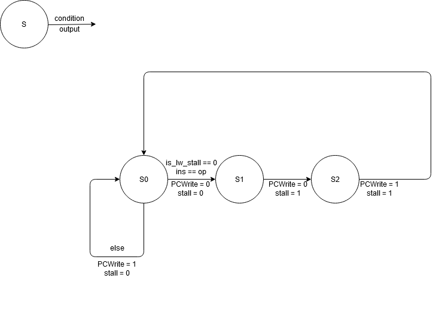

# Lab5 Report

## PB18111684 吴钰同

[toc]

### 实验要求

设计实现有相关处理的流水线CPU，包括无延迟分支的控制相关处理和数据相关处理（定向路径和流水线互锁），并进行功能仿真。

### 逻辑设计

由于书上的数据通路缺少一些关键部分，所以我对其进行了修改和补充，主要调整如下：

- 把 beq 指令的比较和跳转地址计算从 ID 段移至 EX 段，这样虽然 beq 指令后面要添加两个周期的 stall ，效率变低，但是无需考虑 beq 前面的指令与 beq 指令的数据相关（那样要么需要添加额外的转发，要么需要额外 stall 两个周期），数据通路较为简单。

- 对于 stall 的处理，我的实现与书上不同：书上只有对 lw 指令的 stall ，要想判断 lw 指令与后一条指令是否相关，必须已经取出了后一条指令。而且 stall 之后，lw 的后一条指令仍然要执行。但是由于要求没有延迟分支， beq 指令执行完成之前它后面的指令都不能执行；如果 beq 成功，beq 后面的指令就不会执行。即 beq 指令在 IF 段就要关闭 PC 寄存器的使能，故不能使用书上的方法。此处我根据数据存储器读口 ins 的值，并使用有限状态机进行 stall 操作，即检测到 beq 时，就将下一条要执行的指令换成 nop 。lw 的 stall 与此类似，只是判断条件换成了比较 ins 和 IF_ID_IR_out。
- 书上没有 jump 指令，我把它和 beq 放到一起了，实际上可以提前一个周期 jump ，我这样做是为了让跳转指令都 stall 两个周期，可以直接调用写好的状态机。
- 为实现寄存器堆先写后读，我把写操作设成了时钟下降沿有效。
- 书上在判断是否需要转发时没有考虑 \$0 始终为 0 ，而转发是在写回之前，所以 \$0 不能转发。
- 书上没考虑 sw 指令所用到的 B 寄存器的数据相关，应该在 B 寄存器处也安排转发。

#### 数据通路


#### 状态图

##### lw 指令


##### beq 和 jump 指令



### 核心代码

**CPU**

```verilog
`timescale 1ns / 1ps

module CPU( //流水线 CPU
    input clk, //上升沿有效
    input rst, //异步复位，高电平有效
    input [7:0] m_rf_addr, // MEM/RF 的调试读口地址，复位时为零
    output [31:0] m_data,  // MEM 的数据
    output [31:0] rf_data  // RF 的数据
    );
    parameter add=6'b000000;
    parameter addi=6'b001000;
    parameter lw=6'b100011;
    parameter sw=6'b101011;
    parameter beq=6'b000100;
    parameter j=6'b000010;
    parameter ins_nop=32'h0;
    
    reg RegDst,ALUSrc,Jump,Branch,MemRead,MemWrite,RegWrite,MemtoReg;
    reg [2:0] ALUm;
    wire ID_EX_RegDst,ID_EX_ALUSrc,ID_EX_Branch,ID_EX_MemRead,ID_EX_MemWrite,ID_EX_RegWrite,ID_EX_MemtoReg,ID_EX_Jump;
    wire EX_MEM_MemRead,EX_MEM_MemWrite,EX_MEM_RegWrite,EX_MEM_MemtoReg,EX_MEM_Branch;
    wire MEM_WB_RegWrite,MEM_WB_MemtoReg;
    wire [2:0] ID_EX_ALUm;
    wire PCSrc;
    wire [1:0] ALUSrc2,ALUSrc1,BSrc;
    wire PCWrite,stall,PCWrite_beq,stall_beq,PCWrite_j,stall_j,stall_lw,PCWrite_lw;
    wire [31:0] npc,pc,ins;
    wire [31:0] IF_ID_NPC_out, IF_ID_IR_out, Regs_rd1, Regs_rd2,
                ID_EX_NPC_out,ID_EX_A_out,ID_EX_B_out,ID_EX_Imm_out,ALU2_out,ALU1_out,
                M4_out,M3_out,EX_MEM_ALUout_out,EX_MEM_B_out,DataMem_rd,MEM_WB_MDR_out,
                MEM_WB_ALUout_out,Jumpaddr,M5_out,M6_out,M7_out,ID_EX_Jumpaddr_out;
    wire [4:0] MEM_WB_IR_out,EX_MEM_IR_out,M2_out;
    wire [14:0] ID_EX_IR_out;
    wire ALU1_zf;
    wire [31:0] IF_pc,ID_pc,EX_pc,MEM_pc,WB_pc;
    wire flag;
    wire is_lw_stall;
    
    assign IF_pc=pc;
    assign ID_pc=pc-4;
    assign EX_pc=pc-8;
    assign MEM_pc=pc-12;
    assign WB_pc=pc-16;
    
     //Data Path
    //Register
    Register PC_register (.d(npc), .clk(clk), .en(PCWrite), .rst(rst), .q(pc));
    
    Register IF_ID_NPC (.d(pc+4), .clk(clk), .en(1), .rst(rst), .q(IF_ID_NPC_out));
    Register IF_ID_IR (.d(M5_out), .clk(clk), .en(1), .rst(rst), .q(IF_ID_IR_out));

    Register ID_EX_NPC (.d(IF_ID_NPC_out), .clk(clk), .en(1), .rst(rst), .q(ID_EX_NPC_out));
    Register ID_EX_A (.d(Regs_rd1), .clk(clk), .en(1), .rst(rst), .q(ID_EX_A_out));
    Register ID_EX_B (.d(Regs_rd2), .clk(clk), .en(1), .rst(rst), .q(ID_EX_B_out));
    Register ID_EX_Imm (.d({ { 16{IF_ID_IR_out[15]} } , IF_ID_IR_out[15:0]}), .clk(clk), .en(1), .rst(rst), .q(ID_EX_Imm_out));
    Register ID_EX_Jumpaddr (.d(Jumpaddr), .clk(clk), .en(1), .rst(rst), .q(ID_EX_Jumpaddr_out));
    Register #(.WIDTH(15)) ID_EX_IR (.d(IF_ID_IR_out[25:11]), .clk(clk), .en(1), .rst(rst), .q(ID_EX_IR_out));
    Register #(.WIDTH(2)) ID_EX_WB (.d({ RegWrite,MemtoReg }), .clk(clk), .en(1), .rst(rst), .q({ ID_EX_RegWrite,ID_EX_MemtoReg }));
    Register #(.WIDTH(3)) ID_EX_M (.d({ Branch,MemRead,MemWrite }), .clk(clk), .en(1), .rst(rst), .q({ ID_EX_Branch,ID_EX_MemRead,ID_EX_MemWrite }));
    Register #(.WIDTH(6)) ID_EX_EX (.d({Jump,RegDst,ALUSrc,ALUm }), .clk(clk), .en(1), .rst(rst), .q({ ID_EX_Jump,ID_EX_RegDst,ID_EX_ALUSrc,ID_EX_ALUm }));
    
    Register EX_MEM_ALUout (.d(ALU1_out), .clk(clk), .en(1), .rst(rst), .q(EX_MEM_ALUout_out));
    Register EX_MEM_B  (.d(M7_out), .clk(clk), .en(1), .rst(rst), .q(EX_MEM_B_out));
    Register #(.WIDTH(5)) EX_MEM_IR  (.d(M2_out), .clk(clk), .en(1), .rst(rst), .q(EX_MEM_IR_out));
    Register #(.WIDTH(2)) EX_MEM_WB (.d({ ID_EX_RegWrite,ID_EX_MemtoReg }), .clk(clk), .en(1), .rst(rst), .q({ EX_MEM_RegWrite,EX_MEM_MemtoReg }));
    Register #(.WIDTH(3)) EX_MEM_M (.d({ID_EX_MemRead,ID_EX_MemWrite,ID_EX_Branch }), .clk(clk), .en(1), .rst(rst), .q({EX_MEM_MemRead,EX_MEM_MemWrite,EX_MEM_Branch }));
    
    Register MEM_WB_MDR (.d(DataMem_rd), .clk(clk), .en(1), .rst(rst), .q(MEM_WB_MDR_out));
    Register MEM_WB_ALUout (.d(EX_MEM_ALUout_out), .clk(clk), .en(1), .rst(rst), .q(MEM_WB_ALUout_out));
    Register #(.WIDTH(5)) MEM_WB_IR (.d(EX_MEM_IR_out), .clk(clk), .en(1), .rst(rst), .q(MEM_WB_IR_out));
    Register #(.WIDTH(2)) MEM_WB_WB (.d({ EX_MEM_RegWrite,EX_MEM_MemtoReg }), .clk(clk), .en(1), .rst(rst), .q({ MEM_WB_RegWrite,MEM_WB_MemtoReg }));

    //MUX
    MUX M1 (.s( {ID_EX_Jump,PCSrc} ), .w0(pc+4), .w1(ALU2_out), .w2(ID_EX_Jumpaddr_out), .w3(ID_EX_Jumpaddr_out), .o(npc));
    MUX #(.WIDTH(5)) M2 (.s( {0,ID_EX_RegDst} ), .w0(ID_EX_IR_out[9:5]), .w1(ID_EX_IR_out[4:0]), .o(M2_out));
    MUX M3 (.s(ID_EX_ALUSrc?2'b11:ALUSrc2), .w0(ID_EX_B_out), .w1(EX_MEM_ALUout_out), .w2(M4_out), .w3(ID_EX_Imm_out), .o(M3_out));
    MUX M4 (.s( {0,MEM_WB_MemtoReg} ), .w0(MEM_WB_ALUout_out), .w1(MEM_WB_MDR_out), .o(M4_out));
    MUX M5 (.s({0 ,stall}), .w0(ins), .w1(ins_nop), .o(M5_out) );
    MUX M6 (.s(ALUSrc1), .w0(ID_EX_A_out), .w1(EX_MEM_ALUout_out), .w2(M4_out), .o(M6_out));
    MUX M7 (.s(BSrc), .w0(ID_EX_B_out), .w1(EX_MEM_ALUout_out), .w2(M4_out), .o(M7_out));
    
    //ALU
    ALU ALU1 (.y(ALU1_out), .m(ID_EX_ALUm), .a(M6_out), .b(M3_out), .zf(ALU1_zf), .rst(rst));
    ALU ALU2 (.y(ALU2_out), .m(3'b000), .a(ID_EX_NPC_out), .b(ID_EX_Imm_out<<2), .rst(rst));

    Instruction_Memory Instruction_Memory(.a(pc[31:2]),.spo(ins));
    Data_Memory Data_Memory(.a(EX_MEM_ALUout_out[31:2]),.d(EX_MEM_B_out),.clk(clk),.we(EX_MEM_MemWrite),.spo(DataMem_rd), .dpra({10'h0,m_rf_addr[7:2]}),.dpo(m_data));
    Register_File Registers (.clk(clk), .ra1(IF_ID_IR_out[25:21]), .ra2(IF_ID_IR_out[20:16]), .ra3(m_rf_addr[4:0]), .wa(MEM_WB_IR_out), .wd(M4_out), .we(MEM_WB_RegWrite), .rd1(Regs_rd1), .rd2(Regs_rd2), .rd3(rf_data));

    assign PCSrc=ID_EX_Branch&ALU1_zf;
    assign Jumpaddr={IF_ID_NPC_out[31:28],IF_ID_IR_out[25:0]<<2};
    assign PCWrite=PCWrite_beq&PCWrite_j&PCWrite_lw;
    assign stall=stall_beq|stall_j|stall_lw;
    assign flag= (IF_ID_IR_out[31:26]==lw) && ( (IF_ID_IR_out[20:16]==ins[25:21]) || (IF_ID_IR_out[20:16]==ins[20:16]) );
    
    //Control Unit
    always@(*) begin
        {Jump,Branch,MemRead,MemtoReg,MemWrite,ALUSrc,RegWrite,RegDst}=9'b0;
        ALUm=3'b111;
        case(IF_ID_IR_out[31:26])
            add: begin
                ALUm=3'b000;
                RegWrite=1;
                RegDst=1;
            end
            addi:begin
                ALUm=3'b000;
                RegWrite=1;
                ALUSrc=1;
            end
            lw: begin
                ALUm=3'b000;
                MemRead=1;
                MemtoReg=1;
                ALUSrc=1;
                RegWrite=1;
            end
            sw: begin
                ALUm=3'b000;
                MemWrite=1;
                ALUSrc=1;
            end
            beq: begin
                Branch=1;
                ALUm=3'b001;
            end
            j: Jump=1;
        endcase 
        if(~|IF_ID_IR_out) begin 
            //when IR inits, the instruction bits are all zero, so I set it as nop
            {Jump,Branch,MemRead,MemtoReg,MemWrite,ALUSrc,RegWrite,RegDst}=9'b0;
            ALUm=3'b111;
        end
    end
    //Forwarding Unit
    Forwarding_Unit FU(ID_EX_IR_out[14:10], ID_EX_IR_out[9:5], EX_MEM_IR_out, MEM_WB_IR_out, EX_MEM_RegWrite, MEM_WB_RegWrite, ALUSrc1, ALUSrc2, BSrc);
    //Hazard Detection Unit
    Nop_2cycle nop_beq (clk,rst,ins[31:26],beq,is_lw_stall,PCWrite_beq,stall_beq);
    Nop_2cycle nop_j (clk,rst,ins[31:26],j,is_lw_stall,PCWrite_j,stall_j);
    Nop_1cycle nop_lw (clk,rst,flag,PCWrite_lw,stall_lw,is_lw_stall);
```

### 仿真结果及分析

#### test1


在 PC=76 的 sw 指令后三个周期之后 [0x08]=1 ，且 PC=80 ，说明程序正常运行。

#### test2


在 PC=76 的 addi 取指后四个周期之后 $t1=2 ，且 PC=88， 说明程序正常运行。

### 实验总结

本次实验我完成了以下任务：

- 根据课件和视频，对数据通路进行魔改，从而编写 CPU 。
- 根据 stall 的设计编写有限状态机。

- 根据助教给的测试代码进行仿真测试。